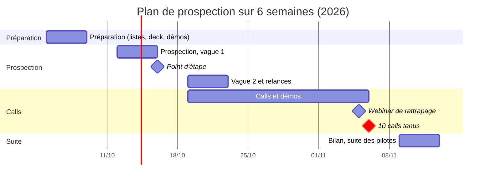

# Plan d'action opérationnel — 10 entreprises

1er octobre 2026 · Quentin Bollore

## Objectif et indicateurs

En 6 semaines (du 5 octobre au 13 novembre 2026), présenter GenRAG à 10 entreprises de 10 secteurs différents en call ou en webinar, et en sortir au moins 3 pilotes sur leurs propres documents.

Le but n'est pas de vendre tout de suite : c'est de vérifier que le problème existe dans chaque secteur, de voir le produit utilisé par de vrais responsables non techniques, et de repartir avec des retours exploitables.

| Indicateur | Cible | Comment on le mesure |
| --- | --- | --- |
| Taux de réponse | 25 % | Réponses / contacts |
| Entreprises contactées | 120 (12 par secteur) | Tableau de suivi |
| Calls ou webinars tenus | 10, un par secteur | Tableau de suivi |
| Problème confirmé | 7 entreprises sur 10 | Elles décrivent d'elles-mêmes les questions répétitives |
| Pilotes lancés | 3 | Un agent déployé sur leurs documents |
| Retours écrits | 10 | Fiche de compte rendu après chaque call |

Les taux (25 % de réponse, 1 pilote sur 3 calls) sont des hypothèses de prospection à froid pour une jeune équipe : ils seront corrigés après la première semaine.

## Le message

Un seul message, décliné par secteur : vos équipes perdent du temps à chercher ou à redemander ce qui est déjà écrit dans vos documents, et GenRAG en fait un assistant qui répond avec les sources, sans développeur.

**La problématique** (2 minutes)

- Les entreprises accumulent des documents internes : procédures, règlements, contrats, fiches techniques, conventions.
- Les mêmes questions reviennent sans cesse vers les mêmes personnes (RH, qualité, support, managers).
- Une IA qui répond sur ces documents demande aujourd'hui des compétences pointues (LLM, RAG, infrastructure) : hors de portée de la plupart des PME.

**La solution** (2 minutes)

- Une plateforme no-code : on importe ses documents, on règle son assistant avec des blocs, on le déploie en un clic.
- Chaque réponse cite ses sources : l'utilisateur peut vérifier.
- Contrôle total sans technique : choix des modèles d'IA, des instructions, de l'architecture.
- Un modèle simple : offre gratuite pour essayer, puis 20 € / mois.

**Le produit, en démo** (10 à 15 minutes, voir le déroulé plus bas)

1. Onboarding guidé : un premier assistant créé en quelques minutes.
2. Import de documents du secteur de l'interlocuteur.
3. Builder visuel : on montre un bloc (reformulation, classement) et ce qu'il change.
4. Playground : 3 vraies questions du métier, réponses avec sources.
5. Déploiement et interface du collaborateur final.

**Le pitch en 3 phrases**, à réutiliser partout (message, intro du call, signature) :

> Vos collaborateurs posent tous les jours des questions dont la réponse est déjà dans vos documents. GenRAG transforme ces documents en assistant qui répond en citant ses sources, configuré en quelques minutes et sans développeur. On cherche 10 entreprises pour le tester sur leurs propres documents et nous dire ce qui manque.

## Ciblage

On vise des PME de 20 à 250 salariés, sans équipe technique interne, et un interlocuteur qui reçoit lui-même les questions répétitives : c'est lui qui ressent le problème et qui peut lancer un pilote.

| # | Secteur | Documents concernés | Questions répétitives typiques | Interlocuteur visé |
| --- | --- | --- | --- | --- |
| 1 | Industrie / production | Procédures qualité, consignes de sécurité, fiches techniques | « Quelle est la procédure si la machine X s'arrête ? » | Responsable qualité / HSE |
| 2 | BTP | Normes, procédures chantier, plans de prévention | « Quelle norme s'applique pour ce type de travaux ? » | Responsable QSE, conducteur de travaux |
| 3 | Expertise comptable | Réglementation, notes internes, modèles de lettres | « Quel taux s'applique pour ce client ? » | Associé, responsable de mission |
| 4 | Juridique (cabinet d'avocats) | Modèles de contrats, notes de recherche | « Avons-nous déjà rédigé une clause de ce type ? » | Associé, knowledge manager |
| 5 | Santé (clinique, EHPAD) | Protocoles de soins, procédures d'hygiène | « Quel est le protocole pour ce cas ? » | Directeur des soins, responsable qualité |
| 6 | Assurance / courtage | Conditions générales, tableaux de garanties | « Ce sinistre est-il couvert par ce contrat ? » | Responsable service client |
| 7 | Immobilier (syndic, gestion locative) | Règlements de copropriété, baux, PV d'assemblée | « Qui paie cette réparation ? » | Gestionnaire, directeur d'agence |
| 8 | E-commerce / retail | Fiches produits, politique de retour, SAV | « Ce produit est-il compatible avec… ? » | Responsable service client |
| 9 | Hôtellerie-restauration | Procédures, manuel d'accueil, onboarding des saisonniers | « Comment fait-on le check-in d'un groupe ? » | Directeur d'établissement, RH |
| 10 | Services numériques (ESN, agence) | Base de connaissance, documentation projets, onboarding | « Où est la doc de ce client ? » | COO, responsable RH |

Le cas d'usage RH (règlement intérieur, convention collective, onboarding), prioritaire dans notre lean canvas, existe dans les 10 secteurs : c'est l'angle de repli si le cas métier ne prend pas.

**Où trouver les contacts**, par ordre d'efficacité :

1. Le réseau proche : famille, amis, anciens maîtres de stage, entreprises partenaires de l'école. Une introduction passée par quelqu'un multiplie le taux de réponse.
2. Les anciens élèves de l'école sur LinkedIn, filtrés par secteur.
3. LinkedIn par recherche directe : secteur + intitulé de poste + région.
4. Les réseaux locaux : CCI, clubs d'entrepreneurs, événements French Tech.
5. Les annuaires sectoriels (ordre des experts-comptables, fédérations du BTP, de l'hôtellerie).

## Prospection

Pour tenir 10 calls, il faut viser environ 120 entreprises (12 par secteur) : on compte 1 réponse sur 4, et une partie des rendez-vous qui sautent.

**Entonnoir de prospection** (hypothèses) — 120 contacts pour tenir 10 calls et lancer 3 pilotes :

| Étape | Volume | Passage depuis l'étape précédente |
| --- | --- | --- |
| Contacts ciblés | 120 | — |
| Réponses | 30 | 25 % |
| Rendez-vous fixés | 14 | 47 % |
| **Calls tenus** | **10** | 71 % |
| Pilotes lancés | 3 | 30 % |

C'est le volume de contacts qui garantit les 10 calls : si le taux de réponse tombe sous 10 % après la vague 1, on double la vague 2 plutôt que d'attendre.

**Séquence par contact** (sur 2 semaines, puis on arrête) :

| Jour | Canal | Action |
| --- | --- | --- |
| J0 | LinkedIn | Invitation avec une note courte (modèle 1) |
| J2 | LinkedIn ou email | Message après acceptation, ou email direct si pas d'acceptation (modèle 2) |
| J7 | Email | Relance courte avec un élément concret : capture ou vidéo de 60 s (modèle 3) |
| J14 | Téléphone ou dernier message | Dernière tentative, puis on passe au suivant |

Le réseau proche passe avant tout : une introduction par une connaissance remplace J0 et J2.

**Modèle 1 — note d'invitation LinkedIn** (300 caractères max)

> Bonjour [Prénom], nous sommes deux étudiants qui développons GenRAG, un assistant IA qui répond aux questions des équipes à partir de leurs documents internes. Je cherche des retours de responsables [qualité / RH / service client] dans le secteur [secteur]. Ravi d'échanger.

**Modèle 2 — premier message ou email**

> Objet : vos questions répétitives sur [procédures / contrats / protocoles]
>
> Bonjour [Prénom],
>
> Dans [secteur], beaucoup d'équipes passent du temps à répondre aux mêmes questions alors que la réponse est déjà écrite quelque part : « [question typique du secteur] ».
>
> Nous développons GenRAG : on importe ses documents et on obtient en quelques minutes un assistant qui répond en citant ses sources, sans développeur.
>
> Nous cherchons 10 entreprises de secteurs différents pour une démo de 30 minutes, et un test gratuit sur vos propres documents si cela vous parle. Seriez-vous disponible [deux créneaux précis] ? Sinon, voici mon agenda : [lien].
>
> [Signature + lien vers le site]

**Modèle 3 — relance**

> Bonjour [Prénom], je me permets de revenir vers vous avec un exemple concret : [lien vidéo 60 s] montre un assistant qui répond sur [un document type du secteur]. 30 minutes cette semaine ou la suivante ?

Règles : toujours personnaliser la question typique, proposer deux créneaux précis plutôt qu'une question ouverte, et noter chaque envoi dans le tableau de suivi le jour même.

## Le call et le webinar

Format par défaut : un call vidéo de 45 minutes par entreprise, à deux (l'un mène l'échange, l'autre fait la démo et prend des notes). Un webinar collectif de 45 minutes, le 5 novembre, rattrape celles qui n'ont pas trouvé de créneau. Les secteurs sont trop différents pour tout faire en webinar : la démo doit parler des documents de chacun.

**Déroulé du call**

| Minutes | Étape | Contenu |
| --- | --- | --- |
| 0–5 | Ouverture | Présentations, objectif du call, accord pour prendre des notes |
| 5–15 | Découverte | Leurs questions de découverte (liste ci-dessous) : on écoute avant de montrer |
| 15–20 | Problématique | Les 3 constats, reliés à ce qu'ils viennent de dire |
| 20–35 | Démo | Les 5 étapes du produit sur des documents de leur secteur |
| 35–42 | Questions et objections | Prix, sécurité des données, fiabilité des réponses |
| 42–45 | Suite | Proposition de pilote, date du prochain point |

**Questions de découverte**

1. Qui reçoit les questions répétitives chez vous, et combien par semaine ?
2. Où sont rangés les documents qui contiennent les réponses ?
3. Que se passe-t-il aujourd'hui quand quelqu'un ne trouve pas l'information ?
4. Avez-vous déjà essayé un outil d'IA ou un chatbot ? Qu'est-ce qui a bloqué ?
5. Qu'est-ce qui vous empêcherait de confier vos documents à un outil externe ?
6. Qui déciderait d'adopter un outil comme celui-ci, et sur quel budget ?

**La démo** : un agent préparé à l'avance par secteur, avec 3 à 5 documents publics du secteur (règlement type, procédure, conditions générales) et 3 questions testées la veille. On ne découvre jamais une question en direct : un début de démo raté coûte tout le call.

**La suite proposée** : un pilote gratuit de 3 semaines, sur leurs documents, avec l'offre Pro et ses crédits offerts, un point d'étape à mi-parcours et un retour écrit à la fin. Si le pilote ne convient pas : leur demander 2 contacts dans leur réseau.

**Après chaque call**, dans les 24 heures : un email de remerciement avec le résumé et la prochaine étape, et une fiche de compte rendu (problème confirmé ou non, objections, intérêt de 1 à 5, citation marquante).

## Calendrier et rôles

10 calls tenus au 6 novembre, bilan la semaine suivante :

| Étape | Dates |
| --- | --- |
| Préparation | 5 – 9 oct. |
| Prospection, vague 1 | 12 – 16 oct. |
| Point d'étape | 16 oct. |
| Vague 2 et relances | 19 – 23 oct. |
| Calls et démos | 19 oct. – 6 nov. |
| Webinar de rattrapage | 5 nov. |
| **10 calls tenus** | **6 nov.** |
| Bilan, suite des pilotes | 9 – 13 nov. |

Les calls commencent dès la 2e vague (19 octobre) : les premières réponses de la vague 1 se transforment en rendez-vous pendant qu'on continue à prospecter. Le point d'étape du 16 octobre décide s'il faut changer l'accroche ou les secteurs.

| Rôle | Responsable | Missions |
| --- | --- | --- |
| Prospection et suivi | Personne A | Liste des contacts, envois et relances, agenda, tableau de suivi |
| Produit et démo | Personne B | Agents de démo par secteur, vidéo, conduite de la démo, corrections avant les calls |
| Calls | Les deux | A mène l'échange, B fait la démo et prend les notes |

Rituel : un point de 30 minutes chaque lundi pour relire les chiffres de la semaine (envois, réponses, rendez-vous) et ajuster la semaine suivante.

## Outils, suivi et préparation

Tout tient dans un tableau de suivi partagé, mis à jour le jour même : une ligne par entreprise retenue (ci-dessous, la meilleure piste de chaque secteur ; les 110 autres contacts vivent dans un tableur à part).

Statuts possibles : À contacter · Contacté · Relancé · RDV fixé · Call fait · Pilote · Abandon.

| Secteur | Entreprise | Contact (nom, poste) | Statut | Prochaine action | Date |
| --- | --- | --- | --- | --- | --- |
| Industrie / production |  |  | À contacter |  |  |
| BTP |  |  | À contacter |  |  |
| Expertise comptable |  |  | À contacter |  |  |
| Juridique |  |  | À contacter |  |  |
| Santé |  |  | À contacter |  |  |
| Assurance / courtage |  |  | À contacter |  |  |
| Immobilier |  |  | À contacter |  |  |
| E-commerce / retail |  |  | À contacter |  |  |
| Hôtellerie-restauration |  |  | À contacter |  |  |
| Services numériques |  |  | À contacter |  |  |

**Outils** (gratuits ou en essai) : LinkedIn (essai Sales Navigator pour filtrer par secteur et taille), une adresse email au nom de domaine du projet, un lien d'agenda (Cal.com ou Calendly) avec des créneaux de 45 minutes, Google Meet pour les calls et le webinar, un tableur pour la liste des 120 contacts.

**À préparer avant le premier contact** (semaine du 5 octobre) :

- [ ] Liste des 120 contacts, 12 par secteur, réseau proche en tête
- [ ] Deck de 8 slides : problématique, solution, démo, pilote, équipe
- [ ] Un agent de démo par secteur, avec 3 à 5 documents publics et 3 questions testées
- [ ] Compte de démo propre (aucune donnée de test visible)
- [ ] Vidéo de démo de 60 secondes pour les relances
- [ ] Offre de pilote écrite : durée, crédits offerts, ce qu'on attend en retour
- [ ] Réponses prêtes sur la sécurité des données : où sont stockés les documents, qui y a accès, suppression à la fin du pilote
- [ ] Lien d'agenda et adresse email du projet
- [ ] Fiche de compte rendu de call (modèle)

## Risques et points à valider

Le risque principal est de ne pas obtenir assez de réponses : il se voit dès la fin de la semaine du 12 octobre, et la parade est prête.

| Risque | Signal d'alerte | Parade |
| --- | --- | --- |
| Trop peu de réponses | Moins de 10 % de réponse après la vague 1 | Revoir l'accroche du modèle 2, passer au téléphone, solliciter davantage le réseau de l'école |
| Un secteur ne répond pas | Aucune réponse sur 12 contacts | Le remplacer par un secteur de réserve : formation, transport et logistique, banque mutualiste |
| Rendez-vous annulés | Plus d'1 annulation sur 3 | Rappel la veille, créneau proposé dans le webinar du 5 novembre |
| Démo qui échoue en direct | Réponse fausse ou lente au playground | Agent testé la veille, vidéo de secours prête à lancer |
| Peur pour la confidentialité des documents | Objection récurrente en call | Pilote sur des documents non sensibles d'abord, réponses écrites sur le stockage et la suppression |
| Intérêt sans suite | Pas de réponse après le call | Relance à J3 avec le résumé, puis demande de 2 contacts |

**À trancher en équipe avant le 5 octobre** :

- [ ] Les 10 secteurs définitifs (garder ceux où le réseau proche a déjà un contact)
- [ ] Qui mène la prospection, qui fait les démos
- [ ] Les conditions exactes du pilote gratuit (durée, crédits, engagement de retour)
- [ ] Ce que la plateforme doit corriger avant les démos (stabilité de l'indexation, temps de réponse)
