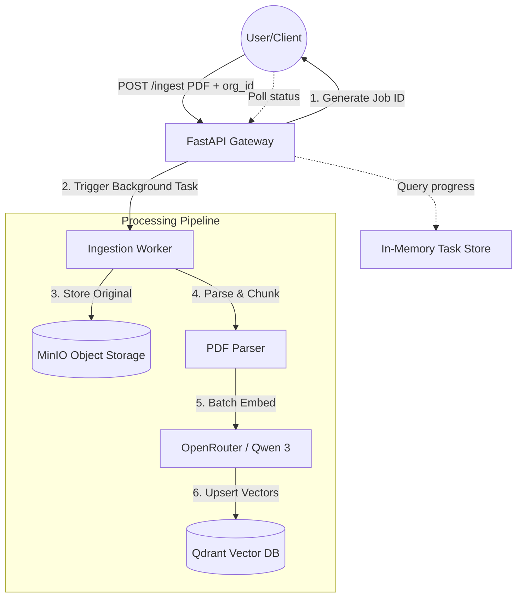
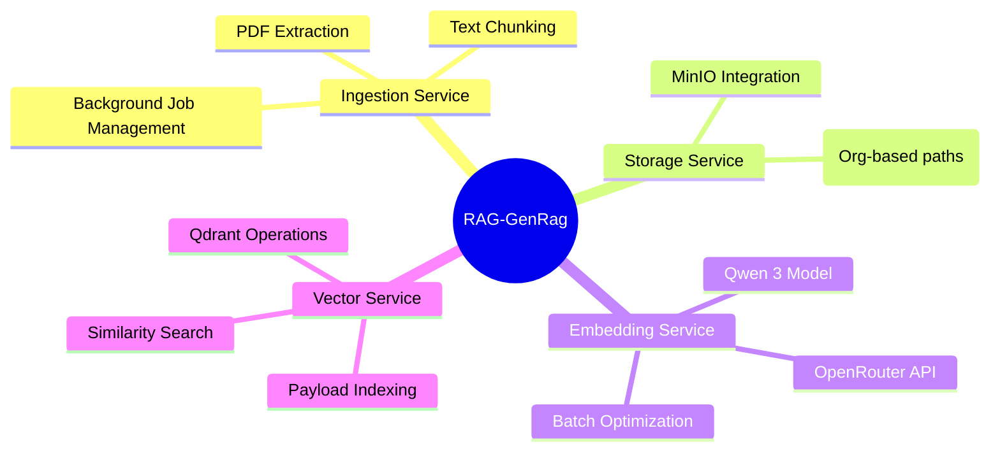

# RAG-GenRag Architecture Diagrams

This document provides a visual overview of the RAG-GenRag project architecture and data flow.

## 1. High-Level System Architecture
This diagram illustrates the end-to-end flow from document upload to background processing and storage.



## 2. Multi-Tenant Isolation Strategy
How data is partitioned and secured between different organizations.

```mermaid
graph LR
    subgraph "Storage Isolation (MinIO)"
        direction TB
        B1[org_id_A / doc1.pdf]
        B2[org_id_B / doc2.pdf]
    end

    subgraph "Vector Isolation (Qdrant)"
        direction TB
        V1[Vector + Payload: {org_id: A}]
        V2[Vector + Payload: {org_id: B}]
    end

    Query[Search Query] -->|Apply org_id Filter| V1
    Query -->|Apply org_id Filter| V2
```

## 3. Service Responsibilities
A breakdown of the core modules within the application.



## 4. Technology Stack
- **API**: FastAPI
- **Storage**: MinIO (S3-compatible)
- **Vector DB**: Qdrant
- **Embeddings**: OpenRouter (Qwen 3 8B)
- **Runtime**: Docker Compose + Python (uv)
